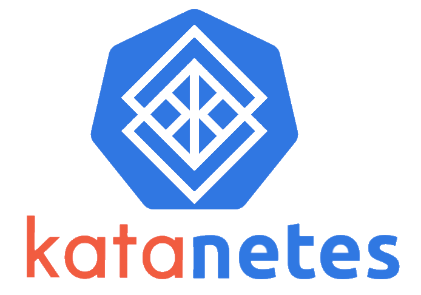

<center>
      
</center>

# Katanetes - Dont compromise K8S and security
Ansible playbooks to setup kata containers for K8S

# Installation
## Requirements
* Ansible
* Make
* cowsay
## Setup
Simply clone the Repo and run the Playbook with our Makefile:
```bash
git clone git@github.com:robbmue/katanetes.git && \
make
```
# Caution
This repo is yet to be final.
We do our best. Your PullRequests are welcome!
